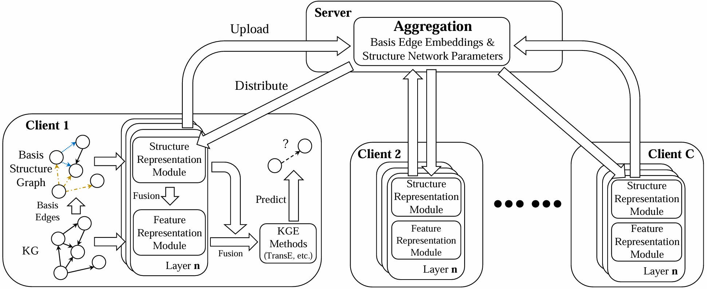

# UniFE
This repository is the implementation of ISWC 2024 paper: Unaligned Federated Knowledge Graph Embedding.
In this work, we propose UniFE, an unaligned federated knowledge graph embedding framework,
which consider the federated KGE in a more realistic scenario (the heterogeneous federated environment without any aligned set).



## Requirements
```
torch==1.13.1+cu117
torch-scatter==2.1.1+pt113cu117
torch-sparse==0.6.17+pt113cu117
torchaudio==0.13.1+cu117
torchmetrics==0.11.4
torchtext==0.14.1
torchvision==0.14.1+cu117
```

## Datasets
The datasets FB15k-237-C3,-C5,-C10 are available at https://github.com/nju-websoft/FedLU.
The dataset NELL-995-Fed3 is available at https://github.com/zjukg/FedE.
Download and put in ./data folder.

## Run
```
python main.py --datasets C3FL --setting unife --local_epoch 3 --nembds_mode single --lr 0.001 --dim 128 --k_w 8 --k_h 16 --score_func conve --local_batch_size 1024 --use_structure
python main.py --datasets C5FL --setting unife --local_epoch 3 --nembds_mode single --lr 0.001 --dim 128 --k_w 8 --k_h 16 --score_func conve --local_batch_size 1024 --use_structure
python main.py --datasets C10FL --setting unife --local_epoch 3 --nembds_mode single --lr 0.001 --dim 128 --k_w 8 --k_h 16 --score_func conve --local_batch_size 1024 --use_structure
python main.py --datasets NELL3 --setting unife --local_epoch 3 --nembds_mode single --lr 0.001 --dim 128 --k_w 8 --k_h 16 --score_func conve --local_batch_size 1024 --use_structure
```

## More Parameters
More parameters can see in main.py .

## Citation
If you find our work useful in your research, please cite:
```
@inproceedings{chen2024unaligned,
  author       = {Deyu Chen and
                  Hong Zhu and
                  Jinguang Gu and
                  Rusi Chen and
                  Meiyi Xie},
  title        = {Unaligned Federated Knowledge Graph
                  Embedding},
  booktitle    = {International Semantic Web Conference},
  year         = {2024},
}
```
